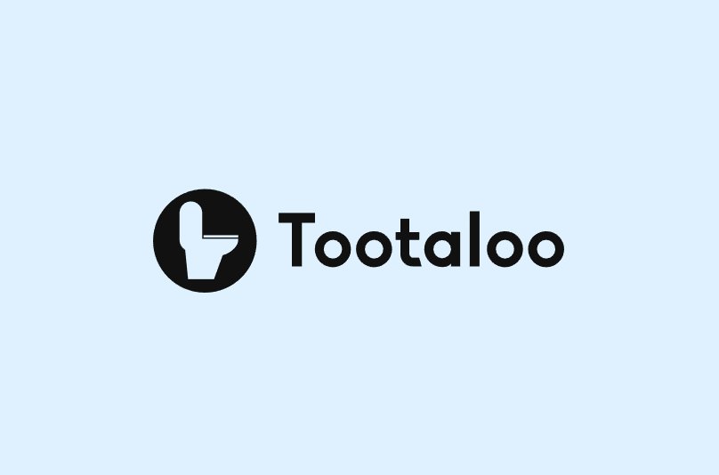
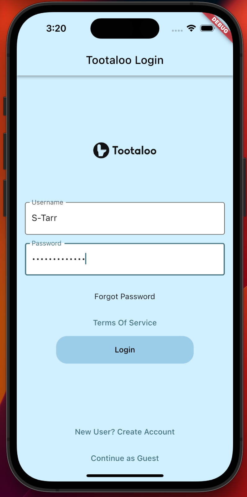
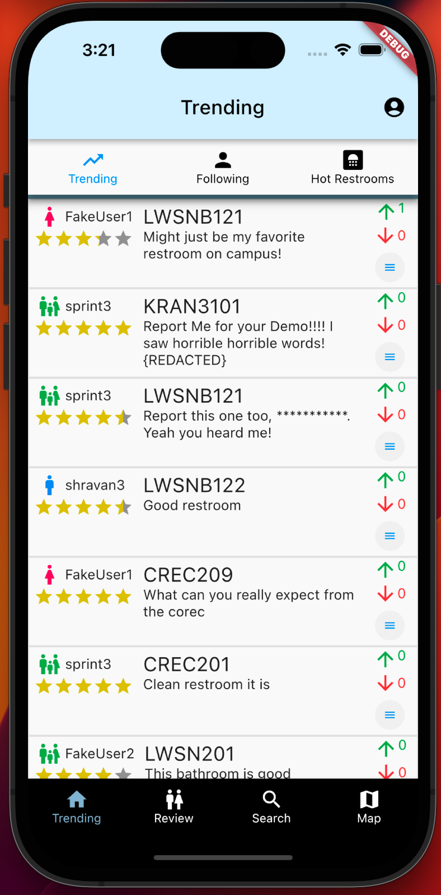
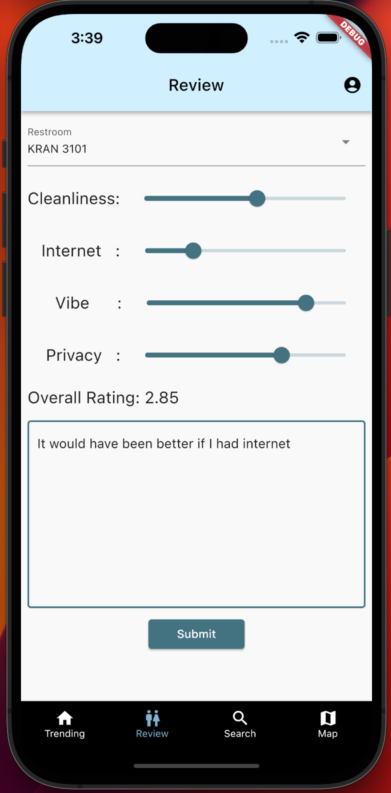
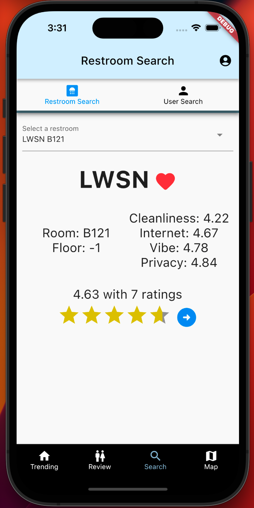
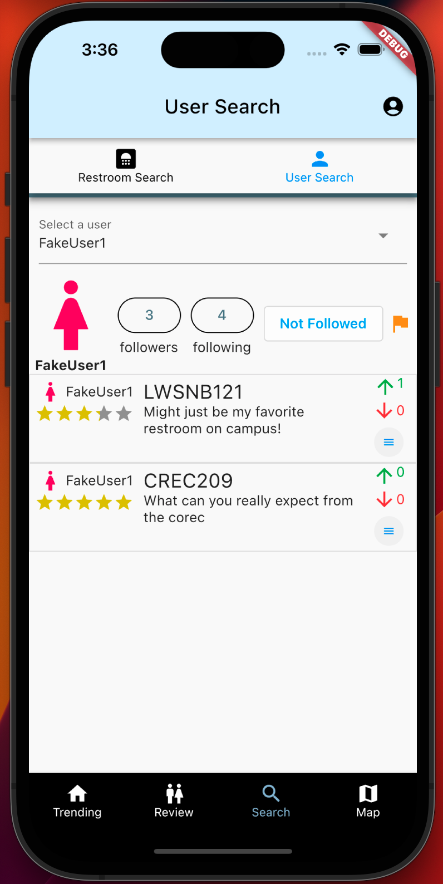
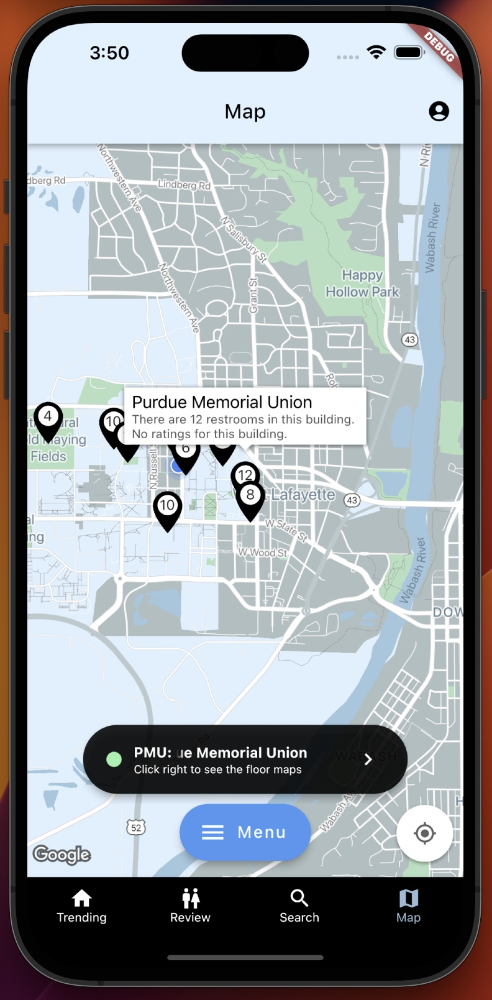

 

# Tootaloo

Tootaloo is a restroom review app allowing users to quickly find and rate top lavtories in their area. Its implementation of social media-esque features allows users to create and view restroom ratings from around the community.

Tootaloo was created in the Spring of 2023 for the CS40700 Software Engineering II class at Purdue University. It was completed over a period of 12 weeks broken down into three 4-week sprints. This project implemented some aspects of the Scrum management framework including the creation of artifacts such as a Project Design Document, Product Backlogs, and Sprint Backlogs, and the use of regular Sprint Reviews and Sprint Retrospectives. The development team consisted of four graduating seniors: **Kichul Kang** (*Github: kckang1003*), **Sam Tarr** (*Github: S-Tarr*), **John Werner** (*Github: jwerner51*), and **Thomas Wiegand** (*Github: twiegan*).

 

# Technologies

- Frontend - Flutter (iOS and Android apps)
- Backend - Django
- Database - MongoDB

 

# Main Features by Sprint

| Sprint 1                            | Sprint 2                            | Sprint 3                            |
| ----------------------------------- |:-----------------------------------:| -----------------------------------:|
| Login/Logout (Firebase)             | Login/Logout Redesign (MongoDB)     | Guest/Admin Access                  |
| Map and Location Services Setup     | Map Functionality (Nearest Bathroom)| Map Functionality (Filtering)       |
| Account Creation                    | Following Functionality             | Favoriting Functionality            |
| Basic UI Layout/Navigation          | Profile Preferences                 | Post Reporting/User Reporting       |
| Trending/Following/Restrooms Pages  | Review Creation                     | Email Verification                  |
|                                     | Bathroom/User Search                | Review Edit/Delete Functionality    |

 

# Contribution Breakdown
Although many portions of the project were a group effort, generally speaking individual team members were responsible for the following areas:

- Kichul Kang
  - Map and Location Services Setup
  - Map Functionality (Nearest Bathroom)
  - Map Functionality (Filtering, Floor Maps)
  - Email Verification
- Sam Tarr
  - Trending/Following/Restrooms Pages
  - Review Creation
  - Review Edit/Delete Functionality
  - Bathroom/User Search Page
- John Werner
  - Login/Logout
  - Account Creation
  - Profile Preferences
  - Guest/Admin Access
- Thomas Wiegand
  - Following Functionality
  - Favoriting Functionality
  - Post Reporting/User Reporting
  - Bathroom/User Search

# Gallery

Login 

Trending 

Review 

Restroom Search 

User Search 

Map 

# Demo
<video src="https://user-images.githubusercontent.com/53661240/235524916-61ccbdc0-21ef-47f7-9e09-5a0f0abcb89e.mov" width=200 height=400 controls="controls"> </video>